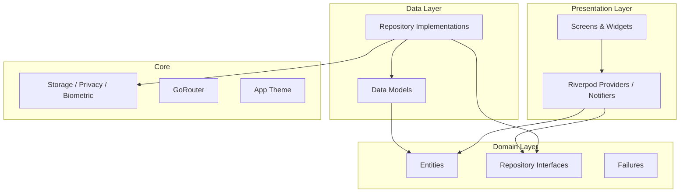

# MindSafe

MindSafe is a secure mental health and mood tracking application built with Flutter. It prioritizes **privacy**, **local-first data storage**, and a **beautiful Material 3 UI** to help users track moods, journal thoughts, and access wellness tools — without compromising sensitive personal data.

## Features

- **Authentication** — Email/password login, registration, biometric unlock, and demo account
- **Mood tracking** — Daily mood logging with energy, stress, sleep, and notes
- **Journal** — Rich text entries with mood tags, search, filters, and auto-save drafts
- **Analytics** — Mood trends, pie charts, and wellness statistics
- **Wellness tools** — Breathing exercises, meditation timer, calming sounds, emergency contacts
- **Profile** — Wellness score, streaks, and achievements
- **Settings** — Theme mode, notifications, language, PIN lock, biometrics, data export
- **Privacy guard** — Inactivity lock, background lock, screenshot blocking, encrypted storage

## Architecture

MindSafe follows **Clean Architecture** with **Riverpod** for state management and **GoRouter** for navigation.



### Layer responsibilities

| Layer | Purpose |
|-------|---------|
| **Presentation** | UI, user input, Riverpod state notifiers |
| **Domain** | Business entities, repository contracts, failures |
| **Data** | Hive persistence, JSON models, repository implementations |
| **Core** | Shared services, routing, theme, widgets, utilities |

## Folder structure

```
lib/
├── core/
│   ├── constants/       # App-wide constants and strings
│   ├── error/           # Result types and failures
│   ├── providers/       # Global Riverpod providers
│   ├── router/          # GoRouter configuration
│   ├── services/        # Storage, privacy, biometrics
│   ├── theme/           # Material 3 light/dark themes
│   ├── utils/           # Converters, validators, extensions
│   └── widgets/         # Reusable UI components (PrivacyGuard, MoodEmoji)
├── features/
│   ├── authentication/  # Login, register, session management
│   ├── mood/            # Mood tracking and history
│   ├── journal/         # Journal entries and drafts
│   ├── analytics/       # Charts and statistics
│   ├── wellness/        # Breathing, meditation, sounds
│   ├── profile/         # User profile and achievements
│   ├── settings/        # App preferences and PIN lock
│   └── home/            # Dashboard and navigation shell
└── main.dart

test/
├── features/            # Repository unit tests
├── widget/              # Widget tests
└── mocks/               # Mocktail mocks and fakes
```

## Packages

| Package | Purpose |
|---------|---------|
| `flutter_riverpod` | State management |
| `go_router` | Declarative routing |
| `freezed` / `json_serializable` | Immutable models and JSON |
| `hive` / `hive_flutter` | Encrypted local database |
| `flutter_secure_storage` | Secure key and session storage |
| `local_auth` | Biometric authentication |
| `fl_chart` | Analytics charts |
| `google_fonts` | Typography |
| `mocktail` | Testing mocks |

## Getting started

### Prerequisites

- Flutter SDK >= 3.2.0
- Dart SDK >= 3.2.0

### Setup

```bash
# 1. Ensure Flutter is installed and on PATH
flutter doctor

# 2. From this project folder — complete platform files if needed
flutter create . --project-name mindsafe --org com.mindsafe

# 3. Install packages
flutter pub get

# 4. (Optional) Regenerate Freezed/JSON if you edit @freezed models
dart run build_runner build --delete-conflicting-outputs

# 5. Run
flutter run
```

> Freezed `.freezed.dart` / `.g.dart` files are already included so the app can build without step 4.
> Add optional calming MP3s under `assets/sounds/` (see that folder’s README).

### Demo credentials

Use these credentials to explore the app immediately:

| Field | Value |
|-------|-------|
| Email | `sarah@mindsafe.app` |
| Password | `MindSafe@2024` |

The demo user is auto-seeded on first launch with sample wellness data.

## Privacy & security

- **AES-encrypted Hive boxes** — All local data encrypted at rest
- **Secure storage** — Session tokens, PIN hashes, and encryption keys stored in platform secure storage
- **PIN lock** — Optional 4-digit PIN with inactivity timeout (5 min) and background lock
- **Auto-logout** — Session cleared after 30 minutes of inactivity
- **Screenshot blocking** — `FLAG_SECURE` on Android when enabled
- **PrivacyGuard** — Wraps authenticated UI to monitor pointer activity and enforce lock overlay
- **No cloud sync** — Data stays on device by default

## Testing

```bash
# Run all tests
flutter test

# Run specific test suites
flutter test test/features/authentication/
flutter test test/widget/
```

Test strategy:

- **Repository tests** — Use `StorageService.inMemory()` via `FakeStorageService` for fast, isolated persistence
- **Widget tests** — `ProviderScope` overrides for auth and storage dependencies
- **Mocks** — `MockStorageService`, `MockBiometricService` in `test/mocks/mock_services.dart`

## Future improvements

- Cloud backup with end-to-end encryption (optional)
- Push notification mood reminders
- Multi-language localization (i18n)
- Wearable / health kit integration for sleep and activity
- Therapist sharing with consent-based export
- Offline-first sync when connectivity returns
- Accessibility audit and screen reader improvements
- CI/CD pipeline with automated tests and coverage

## License

This project is for portfolio and educational purposes. See repository license for details.
